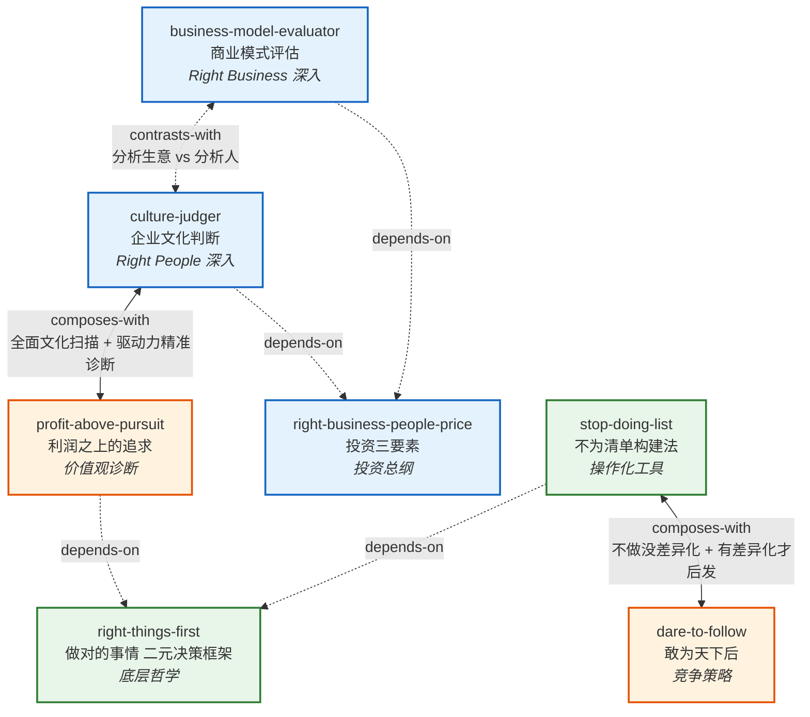

# INDEX — 段永平投资问答录-上（商业逻辑篇）

> 本文档是 book2skill 流水线阶段 3 的产出, 建立所有 skill 之间的引用关系并提供全局导航。

---

## 书籍基本信息

| 字段 | 内容 |
|---|---|
| **书名** | 段永平投资问答录-上（商业逻辑篇） |
| **作者** | 段永平（雪球用户 @Zliya 整理） |
| **出版年** | 2020 |
| **版本来源** | 段永平投资问答录-上（商业逻辑篇）.txt |
| **处理时间** | 2026-04-16 |
| **一句话主旨** | 买股票就是买公司——通过理解"对的生意模式、对的企业文化、对的价格"来识别和长期持有伟大企业 |
| **Skill 数量** | 7 |

---

## Skill 列表（按主题分组）

### 第一组：底层哲学与决策框架

| Skill | 名称 | 核心作用 | 来源章节 |
|---|---|---|---|
| [right-things-first](./right-things-first/SKILL.md) | "做对的事情"二元决策框架 | 整个体系的底层哲学：方向判断（道）优先于执行效率（术） | 第1节 / 第3节 / 第7节 |
| [stop-doing-list](./stop-doing-list/SKILL.md) | Stop Doing List 不为清单构建法 | 将"做对的事情"操作化为具体的不为清单 | 第7节 / 第3节 |

### 第二组：投资总纲与深度分析工具

| Skill | 名称 | 核心作用 | 来源章节 |
|---|---|---|---|
| [right-business-people-price](./right-business-people-price/SKILL.md) | Right Business/Right People/Right Price 投资三要素 | 投资总纲：Business > People > Price | 第2节 / 前言 |
| [business-model-evaluator](./business-model-evaluator/SKILL.md) | 商业模式评估（差异化→护城河→定价能力） | Right Business 维度的深度分析工具 | 第2节 / 第4节 |
| [culture-judger](./culture-judger/SKILL.md) | 企业文化判断框架 | Right People 维度的深度分析工具 | 第3节 / 第1节 |

### 第三组：竞争策略与价值观诊断

| Skill | 名称 | 核心作用 | 来源章节 |
|---|---|---|---|
| [dare-to-follow](./dare-to-follow/SKILL.md) | "敢为天下后"后发制人策略 | 竞争策略：后发的前提是有差异化能力 | 第4节 / 第6节 |
| [profit-above-pursuit](./profit-above-pursuit/SKILL.md) | "利润之上的追求"企业诊断 | 价值观诊断：先问对不对还是先问赚不赚 | 第1节 / 第3节 |

---

## 引用图 (Skill Relationship Graph)



### 关系类型说明

| 关系类型 | 含义 | 图中表现 | 数量 |
|---|---|---|---|
| **depends-on** | A 的使用前提是先理解 B | 虚线箭头 A -.-> B | 4 条 |
| **contrasts-with** | A 和 B 是两种可选方案 | 双向虚线 A <-.-> B | 1 条 |
| **composes-with** | A 和 B 经常配合使用 | 双向实线 A <--> B | 2 条 |

---

## 推荐学习顺序

### 顺序学习路径（由底层到应用）

```
第 1 层：底层哲学
  └─ right-things-first（理解"做对的事情" vs "把事情做对"的道-术二分）

第 2 层：投资总纲
  └─ right-business-people-price（掌握 Business > People > Price 的三要素框架）

第 3 层：深度分析工具（可并行学习）
  ├─ business-model-evaluator（深入 Right Business：差异化→护城河→定价能力）
  └─ culture-judger（深入 Right People：本分/平常心/诚信/消费者导向）

第 4 层：操作化工具（可并行学习）
  ├─ stop-doing-list（将底层哲学操作化为不为清单）
  ├─ dare-to-follow（竞争策略：有差异化才能后发）
  └─ profit-above-pursuit（价值观诊断：利润之上的追求）
```

### 按使用场景推荐

| 场景 | 推荐 Skill 顺序 | 说明 |
|---|---|---|
| **投资新手入门** | right-things-first → right-business-people-price → business-model-evaluator → culture-judger | 先建立正确思维框架，再学分析工具 |
| **创业者/企业家** | right-things-first → stop-doing-list → dare-to-follow → profit-above-pursuit | 聚焦战略决策和竞争策略 |
| **快速评估一家公司** | right-business-people-price → business-model-evaluator + culture-judger → profit-above-pursuit | 用总纲快速定位，再用工具深入 |
| **自我纠错/反思** | right-things-first → stop-doing-list | 从方向判断到具体排除 |

---

## 关系矩阵

下表列出所有 skill 之间的直接关系（空白表示无直接关系）：

|  | right-things-first | stop-doing-list | right-business-people-price | business-model-evaluator | culture-judger | dare-to-follow | profit-above-pursuit |
|---|---|---|---|---|---|---|---|
| **right-things-first** | — | 被依赖 | | | | | 被依赖 |
| **stop-doing-list** | depends-on | — | | | | composes-with | |
| **right-business-people-price** | | | — | 被依赖 | 被依赖 | | |
| **business-model-evaluator** | | | depends-on | — | contrasts-with | | |
| **culture-judger** | | | depends-on | contrasts-with | — | | composes-with |
| **dare-to-follow** | | composes-with | | | | — | |
| **profit-above-pursuit** | depends-on | | | | composes-with | | — |

---

## 审计轨迹

| 阶段 | 产出文件 | 状态 |
|---|---|---|
| 阶段 0：整书理解 | [BOOK_OVERVIEW.md](./BOOK_OVERVIEW.md) | 完成 |
| 阶段 1：候选单元提取 | [candidates/](./candidates/) | 完成 |
| 阶段 1.5：三重验证筛选 | [verified.md](./verified.md) | 完成 |
| 阶段 2：RIA++ 构造 | 各 skill 目录下的 `SKILL.md` | 完成 |
| 阶段 3：Zettelkasten 链接 | 本文件 `INDEX.md` | 完成 |
| 阶段 4：压力测试 | 待执行 | 待开始 |

### Skill 目录结构

```
duan-yongping-business-logic-skill/
├── BOOK_OVERVIEW.md          # 阶段 0 产出
├── INDEX.md                  # 阶段 3 产出（本文件）
├── verified.md               # 阶段 1.5 产出
├── candidates/               # 阶段 1 产出
├── rejected/                 # 阶段 1.5 淘汰的候选
├── right-things-first/
│   └── SKILL.md
├── stop-doing-list/
│   └── SKILL.md
├── right-business-people-price/
│   └── SKILL.md
├── business-model-evaluator/
│   └── SKILL.md
├── culture-judger/
│   └── SKILL.md
├── dare-to-follow/
│   └── SKILL.md
└── profit-above-pursuit/
    └── SKILL.md
```

---

*INDEX.md 生成时间: 2026-04-16 | book2skill pipeline v1*
