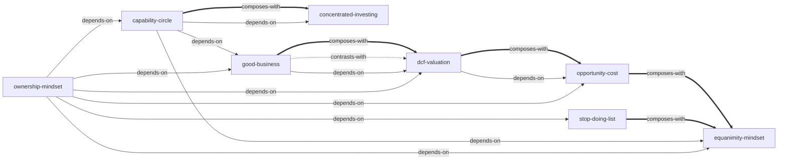

# 段永平投资问答录-下（投资逻辑篇）— Skill Index

> 本书由 book2skill 蒸馏, 共产出 **8** 个 skills。
> 处理时间: 2026-04-16

## 关于这本书

- **作者**: 段永平（问答录整理，源自雪球博客、访谈、交流会）
- **出版年**: 非正式出版（网络整理版）
- **一句话主旨**: 买股票就是买公司——以企业所有者视角，在能力圈内识别好生意，合理价格买入并长期持有
- **整书理解**: 见 [BOOK_OVERVIEW.md](./BOOK_OVERVIEW.md)

---

## Skill 列表 (按主题分组)

### 投资哲学（根基）

- [`ownership-mindset`](./ownership-mindset/SKILL.md) — 买股票就是买公司，以企业所有者视角做一切投资决策
- [`stop-doing-list`](./stop-doing-list/SKILL.md) — 排除法投资纪律，不做什么比做什么更重要

### 分析方法（核心工具）

- [`capability-circle`](./capability-circle/SKILL.md) — 能力圈决策框架，含安全边际=理解度的独特定义
- [`good-business`](./good-business/SKILL.md) — 好生意识别法，商业模式护城河定性分析
- [`dcf-valuation`](./dcf-valuation/SKILL.md) — DCF思维估值法，未来现金流折现的思维方式（非公式）

### 决策框架（实战逻辑）

- [`opportunity-cost`](./opportunity-cost/SKILL.md) — 机会成本决策框架，统一买卖持有的判断标准
- [`concentrated-investing`](./concentrated-investing/SKILL.md) — 集中投资框架，分散是对无知的保护

### 心理管理（执行保障）

- [`equanimity-mindset`](./equanimity-mindset/SKILL.md) — 平常心投资情绪管理，回到本源而非压制情绪

---

## 引用图



图例:
- `-->`  depends-on
- `-.->` contrasts-with
- `===>` composes-with

---

## 推荐学习顺序

(从依赖图的叶子节点开始, 向上)

1. **ownership-mindset** — 最基础，所有投资思考的公理起点
2. **stop-doing-list** — 依赖 ownership-mindset，投资的第一道防线
3. **capability-circle** — 依赖 ownership-mindset，知道"懂不懂"的判断框架
4. **good-business** — 依赖 ownership-mindset + capability-circle，学会识别好生意
5. **dcf-valuation** — 依赖 ownership-mindset + good-business，掌握估值思维（与 good-business 定性vs定量互为补充）
6. **opportunity-cost** — 依赖 ownership-mindset + dcf-valuation，统一买卖决策逻辑
7. **concentrated-investing** — 依赖 capability-circle，从理解走向行动
8. **equanimity-mindset** — 贯穿始终，但需要前置理解才有平常心

---

## 接入 darwin-skill

所有 skill 均带有 `test-prompts.json` (darwin-skill 兼容格式), 可直接接入自动进化:

```
darwin evolve books/duan-yongping-investment-logic-skill/
```

---

## 审计轨迹

- 候选单元池: [candidates/](./candidates/)
- 三重验证结果: [verified.md](./verified.md)
- BOOK_OVERVIEW: [BOOK_OVERVIEW.md](./BOOK_OVERVIEW.md)
